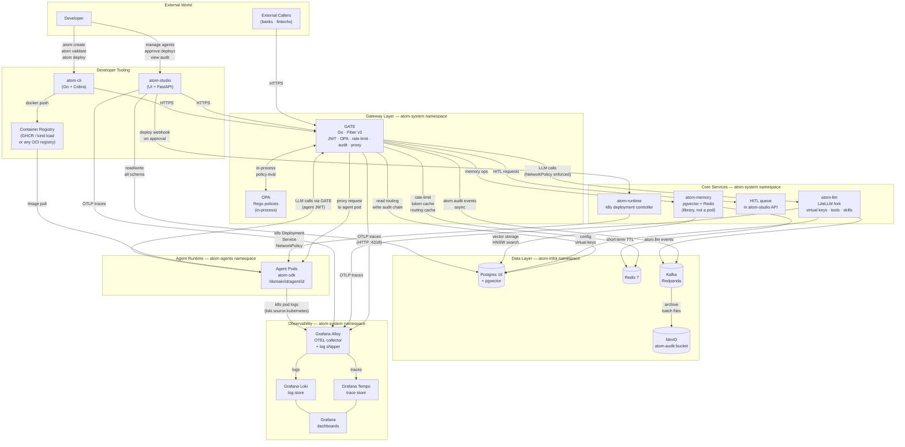
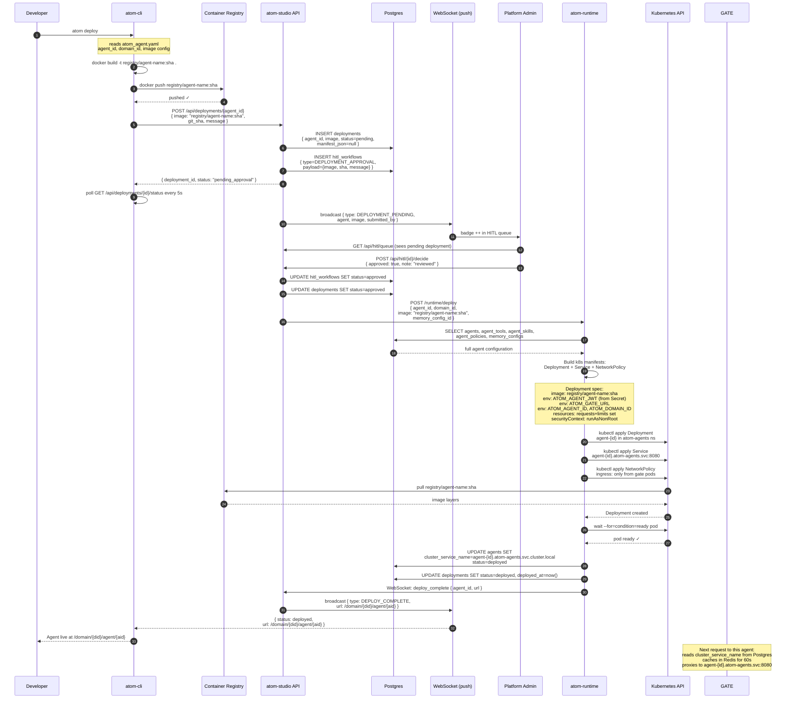
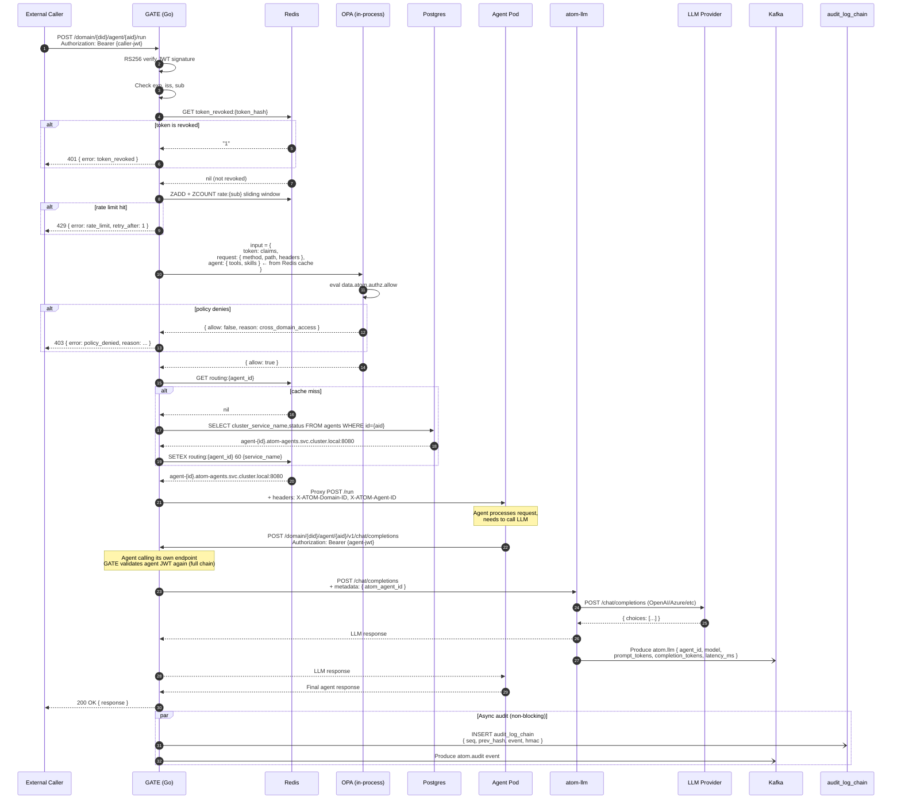
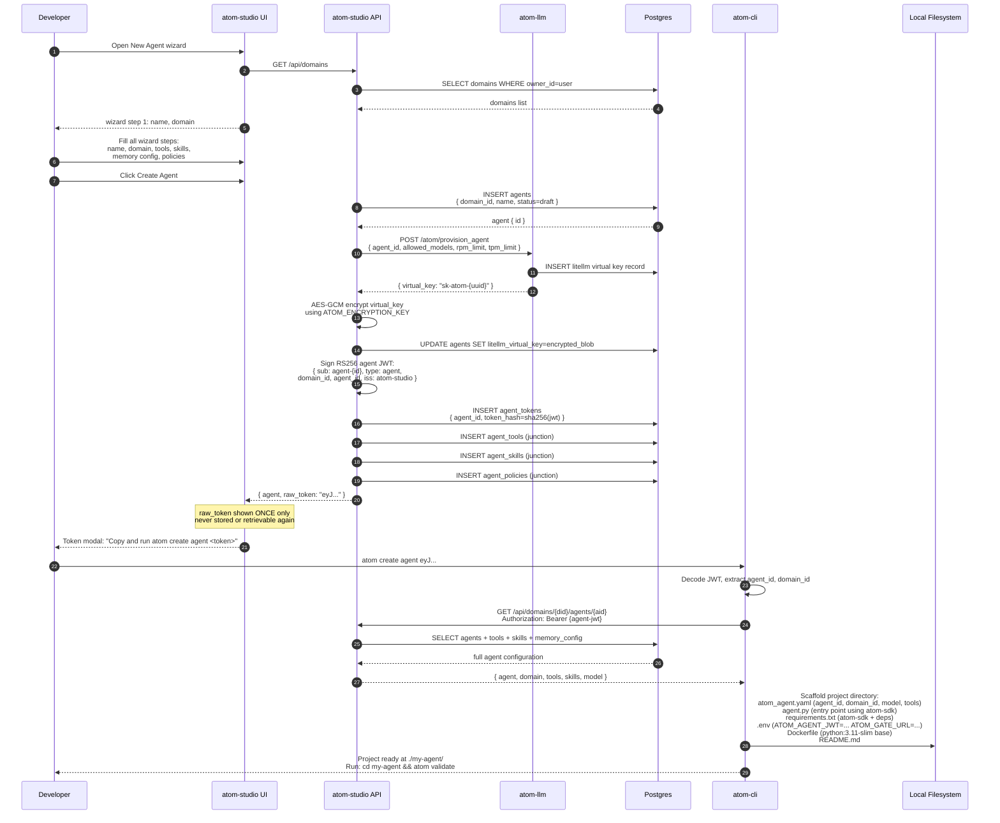
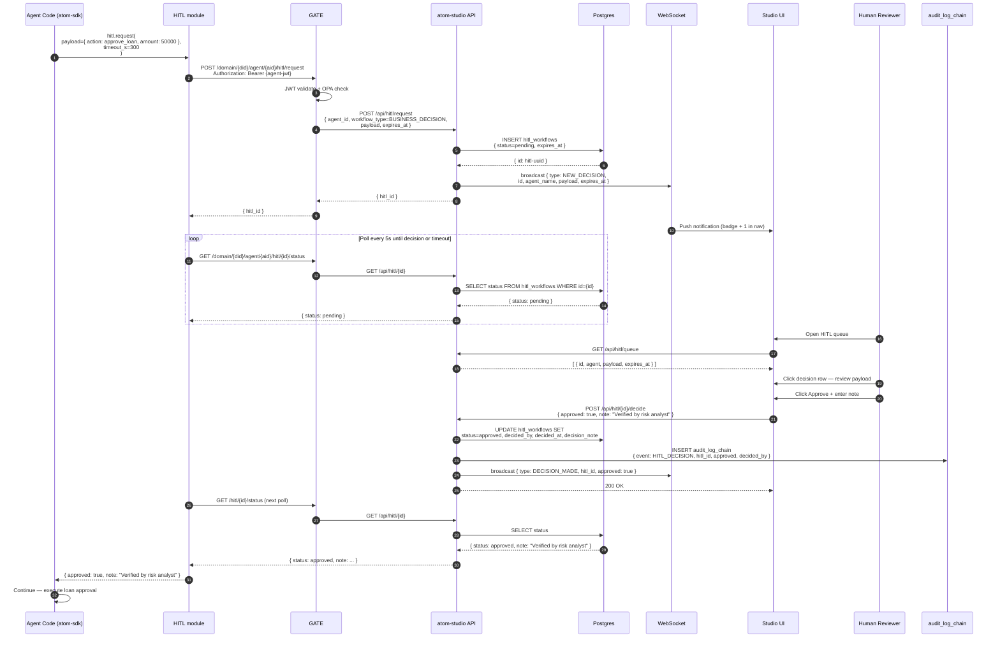
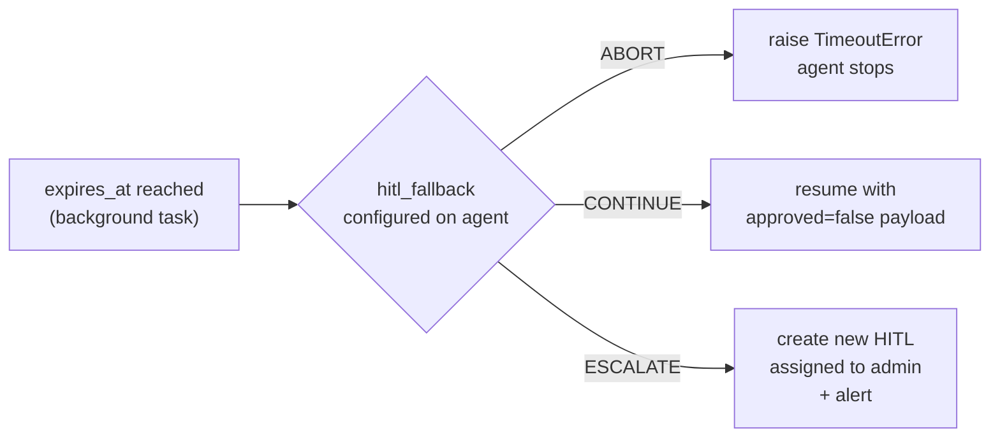
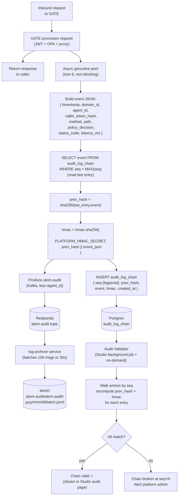
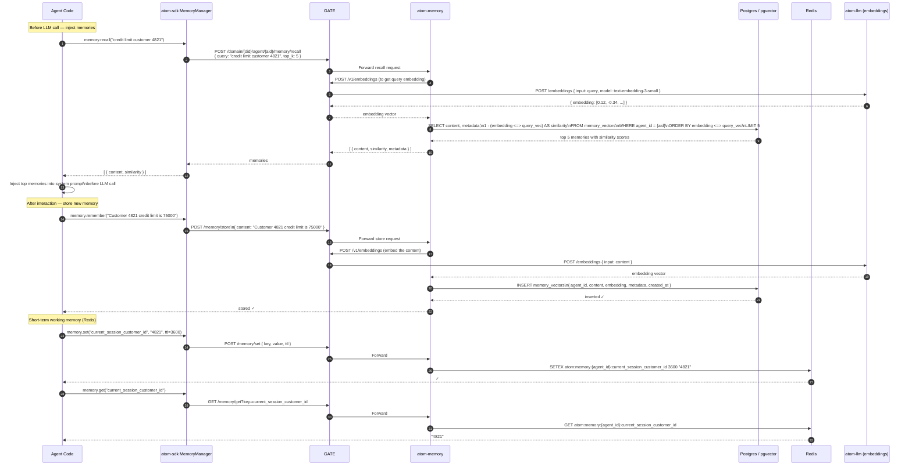
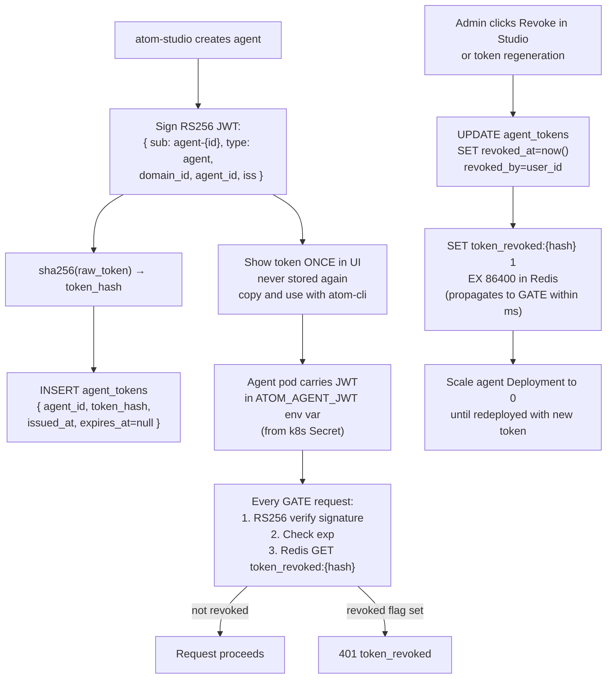
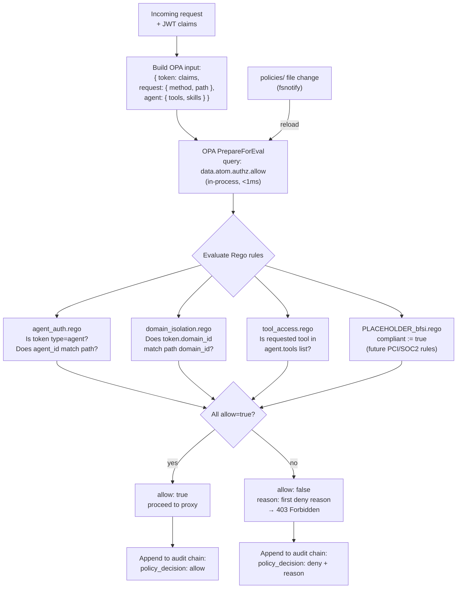

# ATOM — Architecture & Flows

---

## 1. System Architecture



---

## 2. Deployment Flow

> **The most important flow to understand first.**
> The image is built and pushed BEFORE the approval request is submitted.
> Studio stores the image reference. On approval, atom-runtime reads it and creates the k8s Deployment.



### Container Registry Setup

**Local development (kind):**
```bash
# Build agent image and make it available to the kind cluster
docker build -t my-loan-agent:$(git rev-parse --short HEAD) .
kind load docker-image my-loan-agent:$(git rev-parse --short HEAD) --name atom
# then submit to Studio with image ref: my-loan-agent:<sha>
```

**Production / CI:**
```bash
docker build -t ghcr.io/shreyasy2k/my-loan-agent:$(git rev-parse --short HEAD) .
docker push ghcr.io/shreyasy2k/my-loan-agent:$(git rev-parse --short HEAD)
# Kubernetes pulls from GHCR directly (imagePullPolicy: IfNotPresent)
```

Platform services (GATE, atom-llm, etc.) are published to `ghcr.io/shreyasy2k/atom-*:latest`
by GitHub Actions on every merge to main. No local build required for operators.

---

## 3. Runtime Request Flow

> How a request gets from an external caller to an agent pod and back.



---

## 4. Agent Creation Flow

> How an agent goes from idea to a JWT-holding identity in the system.



---

## 5. HITL Decision Flow

> How an agent pauses mid-execution for a human decision and resumes.



### Timeout Behaviour



---

## 6. Audit Chain Flow

> How every GATE request becomes a tamper-evident log entry.



---

## 7. Memory Access Flow

> How agent memory is stored and retrieved during execution.



---

## 8. Token Lifecycle & Revocation

> How agent tokens are issued, used, and revoked.



---

## 9. Policy Evaluation Flow

> How OPA evaluates a policy inside GATE.



---

## Summary: Who Knows What

| Component | What it knows / controls |
|---|---|
| **atom-studio** | Users, domains, agents, tokens, HITL queue, deployment approvals, run history |
| **GATE** | JWT validation, OPA policy, routing table (from PG+Redis cache), audit chain |
| **OPA** | Which agents are allowed to call which resources (in-process, hot-reload) |
| **atom-llm** | Which virtual key maps to which agent; model routing; LiteLLM config |
| **atom-runtime** | How to build k8s manifests; which image to deploy; RBAC for atom-agents ns |
| **atom-memory** | Python library (not a pod) — pgvector long-term + Redis short-term per agent |
| **atom-sdk** | How agents call GATE; how to request HITL; AtomChatModel; memory injection |
| **Container Registry** | Built agent Docker images (GHCR for platform services, any OCI for agents) |
| **Postgres** | Source of truth: users, domains, agents, tokens, deployments, audit chain |
| **Redis** | Fast cache for GATE: rate counters, token revocation blacklist, routing cache |
| **Kafka (Redpanda)** | Ordered event stream: audit, LLM calls, agent logs, deployments |
| **MinIO** | Long-term audit archive; S3-compatible; batched by log-archiver service |
| **Grafana Alloy** | OTLP receiver (traces → Tempo) + k8s log collector (logs → Loki) |
| **Grafana Loki** | Log aggregation and query backend |
| **Grafana Tempo** | Distributed trace storage; TraceQL metrics (local-blocks, no Prometheus) |
| **Grafana** | Unified observability dashboards (GATE, LLM usage, audit chain, agent activity) |
