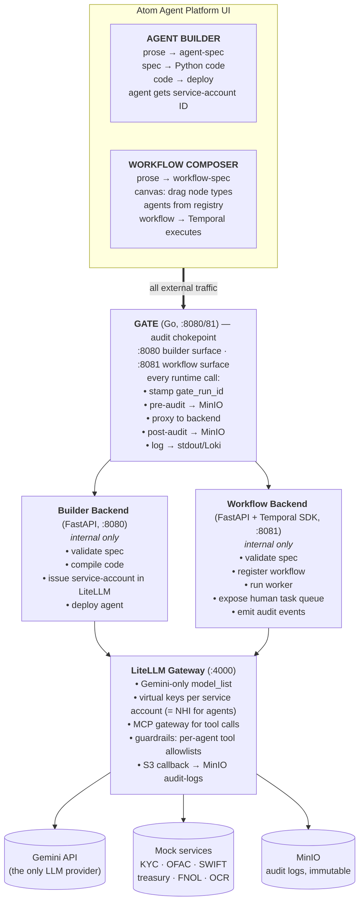
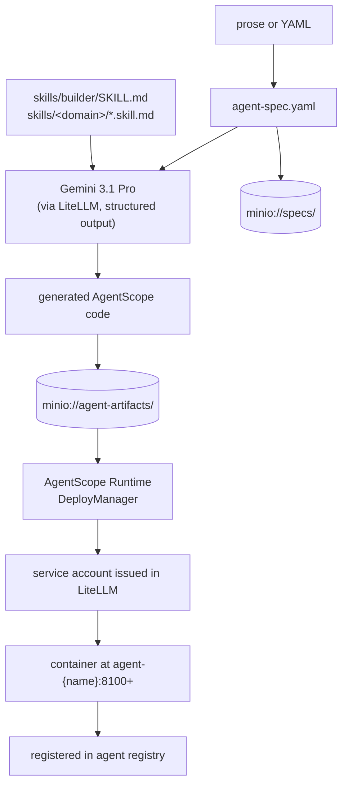
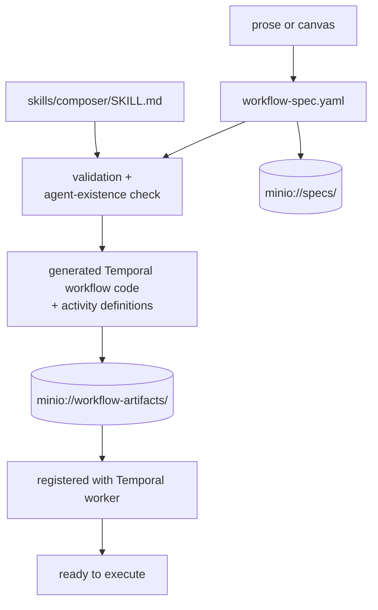

# Architecture

## Skills vs Agent Roles

The platform has two distinct concepts that overlap in name across the industry.
We disambiguate strictly:

**Skills (upstream, capability layer).** Reusable Python functions from the
`agentscope_skills` package (hosted in `packages/agentscope_skills/`, pinned to
a SHA once upstream publishes). Each provides a callable tool — web search,
document parsing, browser use. Generic across domains. Declared in the agent
spec under `agentscope_skills:`.

**Agent roles (ours, role-definition layer).** Markdown files at
`agent-roles/<domain>/<name>.role.md` defining an agent's purpose, boundaries,
output contract, and reasoning approach. Domain-specific. Compose upstream
skills + domain tools registered in `tools/registry.py`. Loaded into the
agent's `sys_prompt` at runtime.

**Generation skills (ours, meta layer).** Markdown files at
`skills/builder/SKILL.md` and `skills/composer/SKILL.md`. Used by the platform
itself to generate agent code (builder) or workflow specs (composer) via Gemini.
Not loaded by deployed agents; only by the platform's own LLM calls.

A deployed agent at runtime has access to:
1. Domain tools registered in `tools/registry.py` (httpx calls to mock services)
2. Upstream skills declared in `agentscope_skills:` (imported from `agentscope_skills` package)
3. Its own role file loaded as the system prompt at startup

---

## Deployment topology — agents

Every deployed agent runs as a containerised FastAPI service managed by
`LocalDeployManager` in `builder-backend/app/core/container.py`. Phase 1 uses
docker-py underneath; Phase 2 replaces the internals with
`KubernetesDeployManager` / `KruiseDeployManager` with no interface change.

The container is built from `atom-runtime-sandbox` (AgentScope
built from source) and runs `uvicorn agent:app --host 0.0.0.0 --port 8100`.

The deployment env injects:
- `LITELLM_API_KEY` — the agent's service-account virtual key (issued by LiteLLM at deploy time)
- `SERVICE_ACCOUNT_ID` — the agent's NHI identity for audit tagging on every LLM call
- `REME_URL` — ReMe memory service endpoint
- `STUDIO_URL` — AgentScope Studio for trace registration
- Domain service URLs — KYC, OFAC, SWIFT, fraud-svc, etc.

The generated `agent.py` exposes:
- `GET /health` → liveness + service_account_id
- `POST /invoke` → accepts structured JSON (workflow path) or `{"text": "..."}` (chat path)

Studio queries AgentScope Runtime's registry to discover agents. Builder-backend
maintains its own metadata registry (owner, deploy time, virtual key id) — the
two registries serve different purposes and are not the same.

---

## Two surfaces, one pipeline



## Component map

| Service | Port | Purpose | Source |
|---|---|---|---|
| `frontend` | 5173 | React UI: Builder + Composer + Audit + Tasks | local |
| `gate` | **8080, 8081** | Go reverse-proxy: intercepts all runtime calls, stamps gate_run_id, writes pre/post audit to MinIO, logs every request. External-only — backends are internal. | local |
| `builder-backend` | 8080 (internal) | FastAPI: agent spec → code → deploy + identity issuance | local |
| `workflow-backend` | 8081 (internal) | FastAPI: workflow spec → Temporal registration; human task queue | local |
| `temporal` | 7233 (gRPC) / 8233 (web) | Workflow engine | image |
| `temporal-db` | 5432 (internal) | Postgres for Temporal | image |
| `litellm` | 4000 | Gemini gateway, MCP, virtual keys, audit | image |
| `litellm-db` | 5432 (internal) | Postgres for LiteLLM | image |
| `studio` | 3000 | AgentScope Studio | **built from source** |
| `runtime-sandbox` | 8001 | AgentScope Runtime sandbox | **built from source** |
| `reme` | 8002 | ReMe memory | **built from source** |
| `reme-db` | 5432 (internal) | Postgres for ReMe | image |
| `minio` | 9000 / 9001 | Audit logs (locked) + artifacts | image |
| `otel-collector` | 4317 / 4318 | OTLP receiver | image |
| `treasury-dw` | 8090 | Mock: positions, securities | local |
| `market-data` | 8091 | Mock: rates, FX | local |
| `lcr-engine` | 8092 | Mock: LCR calc | local |
| `fnol-svc` | 8093 | Mock: insurance policy + claims | local |
| `ocr-svc` | 8094 | Mock: Tesseract OCR | local |
| `kyc-svc` | 8095 | Mock: KYC profile lookup, refresh | local |
| `ofac-svc` | 8096 | Mock: sanctions screening | local |
| `swift-gw` | 8097 | Mock: SWIFT/DTC instruction submit | local |
| `task-queue` | 8098 | Mock: human task queue (back-office) | local |
| `agent-{name}` | 8100+ | Deployed agents (one container each) | generated |

## The four workflow node types

Locked. Do not extend without an architecture proposal.

| Node type | What it does | Inputs | Outputs |
|---|---|---|---|
| `agent` | Invoke a deployed agent. Carries the agent's service-account identity. Optional confidence-threshold routing. | input dict (mapped from upstream node outputs) | agent's response dict |
| `http` | Call an external HTTP API (or registered MCP server). For external system integrations. | URL, method, headers, body template | response body + status |
| `decision` | Pure rule. No LLM. Routes execution based on a Python expression evaluated against the workflow context. | expression, branch labels | next node selection |
| `human_task` | Pause workflow. Post task to queue. Wait for human accept / reject / edit. | task template, assignee group | human's decision + any edits |

## Identity model

Every actor in an audit log entry is one of three types:

| `actor_type` | `actor_id` example | Issued by | Visible in |
|---|---|---|---|
| `agent` | `svc-acct-kyc-refresh-001` | builder-backend at deploy | LiteLLM virtual keys |
| `human` | `user:demo@atom.demo` | hardcoded in demo | login session |
| `system` | `system:workflow-engine` | platform | static |

When the Builder deploys an agent, it:

1. Generates a service account ID: `svc-acct-{agent-name}-{version-hash}`
2. Creates a virtual key in LiteLLM under that ID with the agent's tool allowlist as guardrails
3. Records `owner: <human user>` in the agent registry (not for auth, for accountability)
4. Injects the virtual key into the deployed container as `LITELLM_API_KEY`

When the agent makes any LLM or tool call, that call is logged with `actor_type=agent, actor_id=svc-acct-...`. The `owner` is an attribute on the agent metadata, not the actor.

When a workflow runs:

- The Temporal workflow execution itself logs as `actor_type=system, actor_id=system:workflow-{run-id}`
- Each agent node's invocation logs the agent's own service-account ID
- Each `http` node logs as `actor_type=system` (for V1; in production, separate identities per integration)
- Each `human_task` resolution logs as `actor_type=human, actor_id=user:<who clicked>`

This is what makes the SOC 2 talk track work. AC-2 (account management) and AU-2 (audit events) both apply uniformly across human and non-human actors.

See `docs/identity-and-audit.md` for the full model.

## ATS workflow walkthrough

The flagship demo workflow. Reference spec: `specs/workflows/ats-asset-transfer.yaml`.

```
[1] http       Receive transfer request          → mock incoming queue
[2] agent      KYC refresh                       → kyc-refresh-1.0.0
                                                    confidence < 0.85 → human review
[3] http       OFAC sanctions screening          → mock OFAC service
[4] decision   Amount > $250K?                   → branches to [5a] or [5b]
[5a] agent     Asset reconciliation (routine)    → asset-recon-1.0.0
[5b] human     Compliance review (high-value)    → routes to compliance group
[6] http       Initiate transfer (SWIFT/DTC)     → mock SWIFT gateway
[7] human      Final accept / override           → ops manager
[8] http       Audit + notify                    → final write
```

Three demo paths through this workflow:

1. **Routine** ($40K transfer): all agents fire, decision routes to [5a], one human at [7]. Total time: ~4 min, of which 2 min is the human at [7]. Before: 90 min, all human.
2. **High-value** ($1.2M transfer): KYC agent fires, decision routes to [5b], two humans (compliance + final). Demonstrates "humans still on cases that need judgment."
3. **Confidence breach** (KYC agent low-confidence): KYC agent invokes, returns confidence 0.72, agent node's threshold (0.85) routes to human review *before* OFAC. Demonstrates the safety story.

## Build pipeline (agent)



## Build pipeline (workflow)



## Runtime call flow (ATS routine path)

```mermaid
flowchart TB
    Start(["demo runner clicks 'Run' with sample transfer payload"])
    Post["POST workflow-backend<br/>/workflows/ats-asset-transfer/runs"]
    TempStart["Temporal starts workflow execution"]

    N1["<b>[1] http</b>: receive_transfer_request<br/>→ mock service → MinIO audit (system actor)"]

    N2["<b>[2] agent node</b>: invoke kyc-refresh agent"]
    N2a["workflow-backend POSTs to<br/>agent-kyc-refresh:8100/invoke"]
    N2b["agent runs ReAct loop:<br/>• LLM call → litellm:4000 (virtual key svc-acct-kyc-001) → MinIO audit<br/>• tool calls → litellm MCP gw → kyc-svc → MinIO audit<br/>• produces output {confidence: 0.94, profile: {...}}"]
    N2c["confidence ≥ threshold → continue<br/>workflow logs node completion"]

    N3["<b>[3] http</b>: ofac_screen → ofac-svc → MinIO audit (system actor)"]
    N4{"<b>[4] decision</b><br/>amount > 250000?"}
    N5a["<b>[5a] agent node</b>: invoke asset-recon agent<br/>(similar to [2])"]
    N6["<b>[6] http</b>: swift_initiate → swift-gw → MinIO audit"]

    N7["<b>[7] human_task</b>: post to task-queue, wait"]
    N7a["• workflow execution pauses (Temporal handles durability)<br/>• task appears in UI's 'My Tasks' pane<br/>• demo runner clicks 'Accept'<br/>• human action recorded in audit (human actor)"]

    N8["<b>[8] http</b>: audit + notify → MinIO audit"]
    Done(["workflow complete<br/>final state returned to UI<br/>Studio shows full agent traces<br/>audit pane shows ~30 events across three actor types"])

    Start --> Post --> TempStart --> N1 --> N2
    N2 --> N2a --> N2b --> N2c --> N3
    N3 --> N4
    N4 -->|false| N5a
    N5a --> N6 --> N7
    N7 --> N7a --> N8 --> Done
```



## Auditing — what's logged where

| Event | Logger | Destination | Actor type | Retention |
|---|---|---|---|---|
| LLM call | LiteLLM s3 callback | `minio://audit-logs/llm/{date}/...` | agent (via virtual key) | 90d locked |
| Tool / MCP call | LiteLLM s3 callback | `minio://audit-logs/tool/{date}/...` | agent | 90d locked |
| ReMe operation | LiteLLM (ReMe routes through it) | same | agent (memory caller's identity) | 90d locked |
| Agent generation | builder-backend | `minio://audit-logs/build/{date}/...` | human (creator) | 90d locked |
| Agent deployment + identity issuance | builder-backend | `minio://audit-logs/deploy/{date}/...` | system | 90d locked |
| Workflow generation | workflow-backend | `minio://audit-logs/workflow-build/{date}/...` | human (creator) | 90d locked |
| Workflow execution events (per node) | workflow-backend | `minio://audit-logs/workflow-run/{date}/{run-id}/...` | varies per node type | 90d locked |
| Human task resolution | workflow-backend | `minio://audit-logs/human-task/{date}/...` | human | 90d locked |

The audit pane in the UI is a unified view across all of these.

## Spec → code determinism

Same spec + same skill version + same model snapshot must produce *behaviorally* equivalent code. Determinism strategy with Gemini at temp=1.0:

1. Skills are explicit and prescriptive (templates, not "use your judgment")
2. Generation uses `reasoning_effort="high"` and structured output (`response_format` with JSON schema)
3. Behavioral equivalence tested via golden test cases, not byte identity

This is the honest CISO framing: behavioral determinism, not syntactic identity.

## Build-from-source policy

AgentScope, AgentScope Runtime, AgentScope Studio, ReMe — built from source via `dockerfiles/`, pinned via env vars. **Temporal uses the official image** because it's a CNCF project, not a vendor we're branding.

Adds 10–15 min to first build. Subsequent builds cached.

## Deployment topology — Phase 1

Single-host docker-compose. All services on one Docker network `agentnet`.

## Deployment topology — Phase 2 (when a bank engages)

- Each tier moves to a Kubernetes namespace
- Mock services replaced with bank's actual systems
- AgentScope Runtime uses Kruise sandbox controller
- LiteLLM clustered behind a load balancer
- Temporal scaled to multi-worker; persistence on managed Postgres
- Builder + Workflow backends get RBAC, multi-user, change approval workflow
- Identity issuance integrated with bank IAM (Okta/Azure AD)
- Out of scope for Phase 1

## Out-of-scope

- Direct HTTP from agents (always via registered tool)
- Multi-tenancy
- Real auth (hardcoded demo user)
- Real bank data
- Anthropic / OpenAI fallback
- Workflow loops, parallel forks, sub-workflows
- Building a workflow engine from scratch